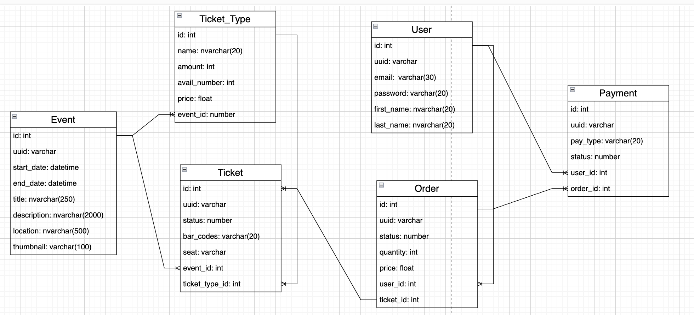

# Book Tickets Kafka Microservice

This is a microservice for booking tickets using Kafka. The project is built with NestJS and TypeORM.

## Prerequisites

- Node.js (v16 or higher)
- npm (v7 or higher)
- MySQL database
- Kafka

## Database design



## Installation

1. Clone the repository:

   ```sh
   git clone https://github.com/your-repo/book-tickets-kafka.git
   cd book-tickets-kafka

   ```

2. Install the dependencies:
   npm install

3. Create .env

DATABASE_HOST=localhost
DATABASE_PORT=3306
DATABASE_USER=root
DATABASE_PASSWORD=password
DATABASE_NAME=book_tickets
KAFKA_BROKER=localhost:9092

4. Setup kafka ( make sure docker-compose cli installed )

```sh
docker-compose -f kafka/docker-compose.yaml up
```

5. Running application:

- Running tickets service:
  npm run start:dev tickets
